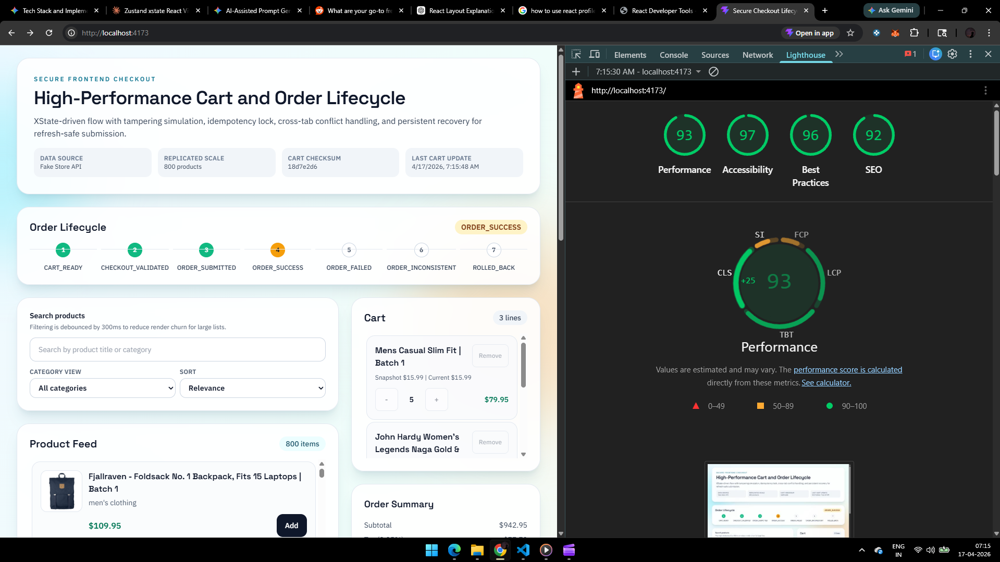

# Performance Techniques and Evidence

## Scope

This report summarizes performance validation for the high-volume checkout UI at 800 products, including DevTools Performance traces, React Profiler evidence, and Lighthouse results.

## What Was Tested

- Product feed scrolling with virtualized list rendering
- Search typing behavior under high-volume data
- Cart quantity updates while product list remains active
- Render behavior in React Profiler
- Lighthouse quality snapshot

## Techniques Implemented

- List virtualization in ProductFeed and CartFeed via react-virtuoso
- Memoized derived state (totals, categories, filtered/sorted product set, product price map)
- Debounced search input (300ms)

## Evidence Matrix

 Normal Usage   
 Fast scrolling through List  
 Cart quantity updates   
 React render behavior  
 Lighthouse snapshot   

## Notes on Metrics

- These are local, single-run measurements and will vary by machine, browser, viewport, and active extensions.

## Conclusion

The project meets the required performance strategy criteria with evidence for:

- Large-list rendering control (virtualization)
- Computational efficiency (memoized derivations)
- High-frequency input protection (debounced search)
- Profiling artifacts (DevTools Performance, React Profiler, Lighthouse)
